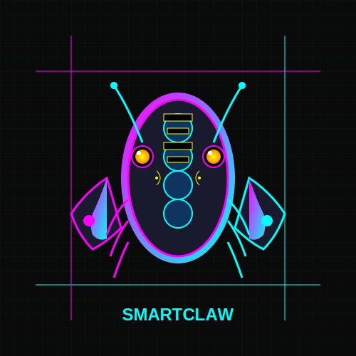

# SmartClaw

An intelligent lobster with critical thinking and self-examination capabilities

## 🦞 Project Overview

SmartClaw is an advanced AI agent creation platform that goes beyond traditional agent frameworks by incorporating self-reflection, knowledge mapping, and adaptive learning capabilities. Inspired by the lobster's remarkable sensory systems and adaptability, SmartClaw creates intelligent agents with structured reasoning and continuous improvement mechanisms.

## 🎯 Core Features

### 1. Knowledge Graph-Aware Agent Creation
When creating AI agents, SmartClaw automatically generates a comprehensive knowledge graph that visualizes:
- Agent structure and decision-making flow
- Integrated skills and capabilities
- MCP (Multi-Cloud Platform) interfaces used by each skill
- Dependency relationships between components
- Knowledge sources and data flows

This knowledge graph provides transparency into how agents operate and enables better debugging, optimization, and extension.

### 2. Self-Testing and Self-Repair Mechanism
After agent creation:
- Automated test suites verify each skill and interface connection
- Comprehensive functionality tests simulate real-world scenarios
- Performance benchmarks ensure efficiency and reliability
- Self-diagnosis algorithms identify and isolate issues
- Auto-repair mechanisms fix common problems without human intervention
- Voice notification system announces agent capabilities and readiness

### 3. Persistent Task Management
For time-based or recurring tasks:
- Task scheduling with flexible time constraints
- Persistent storage in dedicated long-term memory blocks
- Database-backed state management
- Automatic recovery from system failures
- Task prioritization and resource allocation
- Memory block retention until explicitly removed by the user

### 4. Advanced Self-Improvement
- Continuous learning from task execution data
- Self-examination of decision-making processes
- Critical thinking about past performance
- Adaptation to changing environmental conditions
- Knowledge refinement through experience
- Performance optimization over time

### 5. Multi-Agent Collaboration
- Agent communication protocols for teamwork
- Task distribution and load balancing
- Knowledge sharing between agents
- Collaborative problem-solving capabilities
- Hierarchical agent organization

### 6. Extensible Skill Library
- Modular skill architecture
- Easy integration of new capabilities
- Third-party skill marketplace
- Version control for skills
- Skill compatibility verification

## 🏗️ Architecture

```
┌─────────────────────────────────────────────────────────┐
│                    SmartClaw Core                      │
├─────────┬─────────┬─────────┬─────────┬─────────┬───────┤
│  Agent  │  Skill  │  MCP    │  Memory │  Test   │ Voice │
│ Builder │ Library │ Handler │  System │ Engine  │  API  │
└─────────┴─────────┴─────────┴─────────┴─────────┴───────┘
        │           │           │           │           │
        ▼           ▼           ▼           ▼           ▼
┌─────────────────────────────────────────────────────────┐
│                  Knowledge Graph Visualizer             │
└─────────────────────────────────────────────────────────┘
```

## 🚀 Getting Started

### Prerequisites
- Python 3.8+
- Docker (optional, for containerized deployment)
- Access to MCP interfaces
- Voice synthesis API key (optional)

### Installation
```bash
git clone https://github.com/devshilei/SmartClaw.git
cd SmartClaw
pip install -r requirements.txt
```

### Usage Example
```python
from smartclaw import AgentBuilder

# Create a new agent
builder = AgentBuilder()
agent = builder.create_agent(
    name="FinancialAdvisor",
    skills=["market_analysis", "investment_recommendation", "risk_assessment"],
    mcp_interfaces=["stock_data", "news_api", "portfolio_manager"]
)

# Get agent knowledge graph
knowledge_graph = agent.get_knowledge_graph()
knowledge_graph.visualize("financial_advisor_graph.png")

# Run agent tests
test_results = agent.run_self_tests()
print(f"Test Results: {test_results}")

# Schedule a task
agent.schedule_task(
    task_name="daily_market_update",
    frequency="daily",
    time="09:00",
    parameters={"market": "NASDAQ"}
)
```

## 🎨 Logo



## 📁 Project Structure
```
smartclaw/
├── agent_builder/       # Agent creation and configuration
├── skill_library/       # Pre-built skills and capabilities
├── mcp_handler/         # MCP interface management
├── knowledge_graph/     # Knowledge representation and visualization
├── test_engine/         # Self-testing and validation
├── memory_system/       # Persistent storage and task management
├── voice_api/           # Voice notification system
├── examples/            # Usage examples and tutorials
├── docs/                # Documentation
└── tests/               # Unit and integration tests
```

## 🔧 Configuration

SmartClaw can be configured through environment variables or a config.yml file:

```yaml
# config.yml
smartclaw:
  agent_builder:
    default_language: "en"
    auto_test: true
    auto_repair: true
  memory_system:
    database_url: "sqlite:///smartclaw.db"
    retention_policy: "until_removed"
  voice_api:
    provider: "google"
    language: "en-US"
  knowledge_graph:
    visualization_format: "png"
    include_dependencies: true
```

## 🤝 Contributing

We welcome contributions to SmartClaw! Please refer to our [Contributing Guide](CONTRIBUTING.md) for more information.

## 📄 License

SmartClaw is licensed under the [MIT License](LICENSE).

## 📞 Contact

For questions, suggestions, or collaborations, please contact:
- Email: contact@smartclaw.ai
- GitHub Issues: https://github.com/devshilei/SmartClaw/issues
- Discord: [Join our community](https://discord.gg/smartclaw)

## 📈 Roadmap

### Version 1.0
- ✅ Core agent creation framework
- ✅ Knowledge graph generation
- ✅ Basic self-testing capabilities
- ✅ Persistent task management
- ✅ Voice notification system

### Version 1.5
- 🚧 Advanced self-repair mechanisms
- 🚧 Multi-agent collaboration features
- 🚧 Skill marketplace integration
- 🚧 Enhanced visualization tools

### Version 2.0
- 📅 Reinforcement learning-based improvement
- 📅 Natural language agent configuration
- 📅 Cross-platform deployment options
- 📅 Real-time performance monitoring

---

*"Adapt, Reflect, Excel"* - The SmartClaw Philosophy